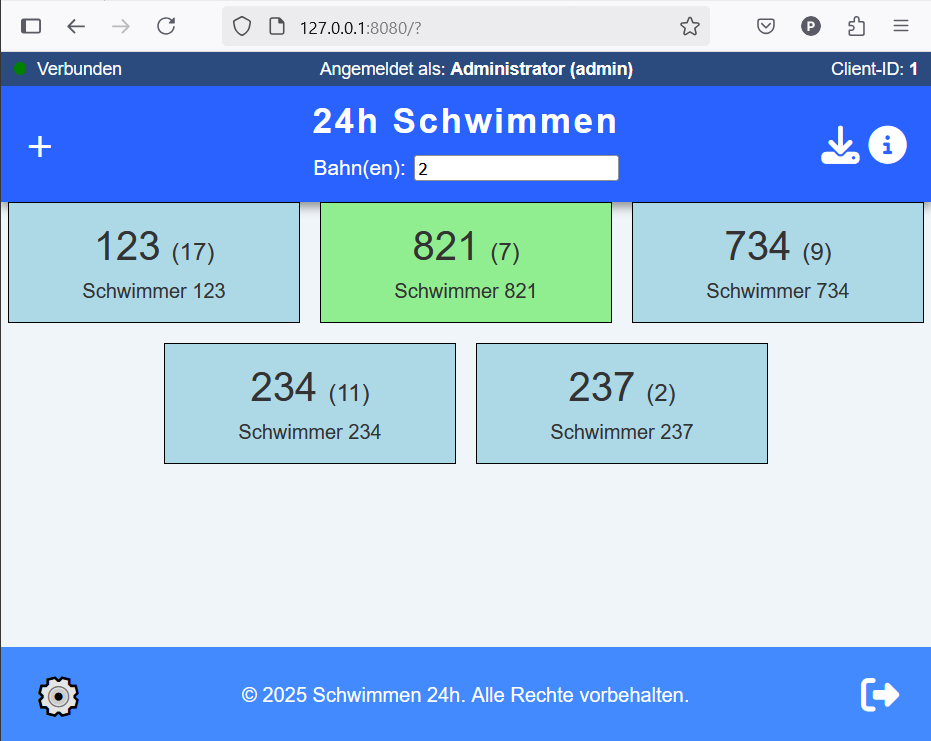

# 24h-Schwimmen

Erfassung von geleisteten Bahnen bei einem 24 Stunden schwimmen

## Szenario

Bei einem 24 Stundenschwimmen sollen digital die geleisteten Bahnen verschiedener Schwimmer innerhalb dieser 24 Stunden auf digitalen Endgeräten erfasst und auf einem zentralen Rechner gesammelt werden.
Dabei soll die Bedienung möglichst intuitiv sein und die Datensicherheit besonders hoch, so dass selbst bei einem Ausfall des Servers oder eines Endgerätes die Informationen auf mehreren Stellen verteilt gespeichert sind.
Die Erfassung soll auf möglichst vielen verschiedenen Endgeräten möglich sein (verschiedene Bildschirmgrößen, responsive Design)

## Quick-Start

### Windows

* Release als ZIP-Datei auf einem Windows-System herunterladen, entpacken und die Exe-Datei ausführen
* Der Browser sollte automatisch starten - einloggen mit ``admin`` und ``swim24``
* unten links auf die Admin-Oberfläche wechseln und im Bereich Schwimmer einige Schwimmer aus dem Ordner testfiles importieren
* Benutzer anlegen
* Zur *normalen* Webseite wechseln und ausprobieren (wieder unten links)

### Linux bzw. Source

* Repository clonen.
* Dann mit ``pip install -r requirements.txt`` die benötigten Pakete installieren und
* die Datei ``wsgiserverwin.py`` oder ``wsgiserver.py`` bzw ausführen.
* Dies startet einen Web-Server auf dem Port 8080, der in der Regel unter ``http://localhost:8080`` mit dem Browser zu erreichen ist.

Eine Basisdatenbank mit dem Benutzer ``admin`` und dem Passwort ``swim24`` wird automatisch angelegt.

## Normale Verwendung und Test

### 1. Konfiguration einrichten

Vor dem ersten Live-Einsatz die `config.json` anpassen (Details: [Konfiguration](#konfiguration-configjson)):

* **`startzeit`** — Startzeit des Wettkampfs als UTC-ISO-Timestamp. **Wichtig:** Der Wert muss in UTC angegeben werden. Ein Wettkampfstart um 9:00 Uhr Ortszeit (MESZ = UTC+2) wird als `"2025-06-21T07:00:00Z"` eingetragen.
* **`laenge_bahn_m`** — Bahnlänge in Metern prüfen (Standard: `100`). Dieser Wert beeinflusst die gesamte Streckenberechnung und den CSV-Export.
* **`flask_secret_key`** — Vor dem Live-Betrieb auf einen langen, zufälligen Wert ändern.

Änderungen werden erst nach einem Neustart des Servers wirksam.

### 2. Benutzer anlegen

Für jeden Bahnbetreuer wird ein eigener Benutzer-Account benötigt. Dies kann im Admin-Bereich manuell oder per CSV-Datei erfolgen (siehe [Benutzer-Import](#benutzer-import-csv)).

Das Standard-Passwort des `admin`-Benutzers (`swim24`) sollte vor dem Live-Betrieb geändert werden (Admin-Bereich → **Benutzer** → Benutzer `admin` auswählen → Passwort ändern).

### 3. Schwimmer importieren

Im Admin-Bereich unter **Schwimmer → CSV-Import** die Schwimmerdaten laden (siehe [Schwimmer-Import](#schwimmer-import-csv)).

### 4. Netzwerk einrichten

Alle Erfassungsgeräte müssen im selben Netzwerk wie der Server erreichbar sein:

* IP-Adresse des Servers ermitteln (unter Windows: `ipconfig` in der Eingabeaufforderung)
* Unter Windows ggf. Port 8080 in der Firewall freigeben (Details: [Windows-Firewall](#windows-firewall))
* WLAN-Zugangspunkt bereitstellen, dem alle Tablets und Smartphones beitreten können

### 5. Clients anmelden (QR-Code)

Im Admin-Bereich gibt es die Schaltfläche **QR-Code anzeigen**, die die Seite `/show_qr` öffnet. Der dort gezeigte QR-Code enthält die Serveradresse. Jedes Erfassungsgerät scannt diesen Code, öffnet die Webseite und meldet sich mit den zuvor angelegten Zugangsdaten an.

### 6. Test vor dem Wettkampf

Um die Erfassung ohne echte Schwimmer zu testen, gibt es eine automatische Klick-Simulation:

1. Erfassungsseite mit dem URL-Parameter `?dbgfkt=true` laden:

   ```text
   http://<server>:8080/v2?dbgfkt=true
   ```

2. Auf die Überschrift **24h-Schwimmen** klicken — die Seite beginnt dann, Bahnen automatisch zu registrieren und an den Server zu senden.
3. Auf der View-Seite (`/view` oder `/view2`) lässt sich beobachten, wie die Bahnzähler hochlaufen.

Zum Beenden die Überschrift erneut anklicken oder die Seite neu laden.

### 7. Nach dem Test: Zurück in den Ausgangszustand

Um nach einem Testlauf mit einem leeren Datenbestand zu starten:

1. Server beenden.
2. Die Datei `data.sqlite` löschen (oder umbenennen, falls man die Testdaten später noch braucht).
3. Server neu starten — eine leere Datenbank mit dem Standard-`admin`-Benutzer wird automatisch angelegt.
4. Schwimmer erneut importieren (Admin-Bereich → **Schwimmer → CSV-Import**).
5. Benutzer erneut importieren oder anlegen (Admin-Bereich → **Benutzer**).
6. Auf allen Erfassungsgeräten die Seite neu laden, damit auch der lokale Browser-Zustand (zwischengespeicherte Actions, Schwimmerliste) zurückgesetzt wird.

Optional: Die Logdatei `data/serverlog.log` löschen, damit das Log beim Live-Betrieb sauber beginnt.

## Wichtiges für den Live-Betrieb

* Der Rechner auf dem der Server läuft, sollte angepasste Energiesparmodi haben, d.h. nicht in den Standby-Wechseln und auch die Festplatte soll nicht abgeschaltet werden. Dazu z.B. unter Windows ``Energiesparplaneinstellungen ändern`` -> ``Erweiterte Einstellungen ändern`` und dort enstprechende Einstellungen vornehmen
* Um in Excel die CSV-Daten zu importieren, erstellt man eine leere Tabelle, wechselt dann in das Menü Daten und dort gibt es einen Reiter Text/CSV-Importieren. Hier kann man auch die Codierung einstellen. In der Regel arbeitet der Server nur mit UTF-8 Daten

## Konfiguration (config.json)

Die Datei `config.json` im Projektverzeichnis enthält alle serverseitigen Einstellungen:

| Schlüssel | Beispielwert | Beschreibung |
| --- | --- | --- |
| `flask_secret_key` | `"Lang&Umständlich"` | Geheimer Schlüssel für Flask-Sessions – vor dem Live-Betrieb ändern |
| `default_admin_pass` | `"swim24"` | Initiales Passwort für den Admin-Benutzer |
| `laenge_schwimmerNr_digits` | `3` | Anzahl Stellen der Schwimmernummer (z. B. 3 → 001–999) |
| `laenge_bahn_m` | `100` | Länge einer Bahn in Metern (für Streckenberechnung) |
| `fade_time_s` | `600` | **Nur v2-Oberfläche** (`/v2`): Sekunden seit dem letzten Klick, nach denen eine Schwimmerkarte blass dargestellt wird. Beim nächsten Betätigen von „Senden" wird der Schwimmer automatisch von der Bahn entfernt. `0` oder `-1` deaktiviert das Feature. |
| `mobile_cards_col` | `2` | **Nur v2-Oberfläche**: Anzahl Schwimmerkarten pro Zeile auf kleinen Bildschirmen (≤ 600 px Breite). |
| `view2_page_interval_s` | `10` | **View2-Seite** (`/view2`): Sekunden pro Seite bei aktiviertem Auto-Weiterblättern (Shift-Lock-Modus). |
| `startzeit` | `"2025-06-14T08:00:00Z"` | **View- und View2-Seite**: Startzeitpunkt des Schwimmens als UTC-ISO-Timestamp. Legt den Beginn der Spezialzeiten (Tag1, Geisterstunde, Gute Nacht, Frühaufsteher, Tag2) fest. |
| `swimmer_list_update_interval_s` | `600` | **View- und View2-Seite**: Intervall in Sekunden, in dem die Schwimmerliste neu vom Server abgefragt wird. Stellt sicher, dass während des Wettkampfs neu angelegte Schwimmer automatisch in der Anzeige erscheinen, ohne manuellen Reload. `0` deaktiviert das automatische Neuladen; ein manuelles Laden der Schwimmerliste ist jederzeit per `Shift+S` möglich. |

Änderungen an `config.json` werden erst nach einem Neustart des Servers wirksam.

## Schwimmer-Import (CSV)

Im Admin-Bereich unter **Schwimmer** können Schwimmerdaten per CSV-Datei importiert werden.

### Vorgehensweise

1. CSV-Datei auswählen — die erste Zeile muss Spaltenüberschriften enthalten.
2. Im Dialog wird jede **CSV-Spalte** (fett) einem **Datenbankfeld** zugeordnet. Nicht benötigte Spalten auf *Ignorieren* lassen.
3. Pflichtfeld ist `nummer`. Alle anderen Felder sind optional.
4. Klick auf **Importieren** überträgt die Daten.

### Unterstützte Felder

| Datenbankfeld | Bedeutung |
| --- | --- |
| `nummer` | Schwimmernummer (Pflicht, eindeutiger Schlüssel) |
| `vorname` | Vorname |
| `nachname` | Nachname |
| `gruppe` | Gruppe / Team |
| `istKind` | `1` = Kind, `0` = Erwachsener |
| `istErw` | Alternative zu `istKind`: `0` = kein Erwachsener → wird intern als Kind (`istKind = 1`) gespeichert |

### Verhalten bei bereits vorhandenen Schwimmern (Duplikate)

Existiert ein Schwimmer mit der importierten Nummer bereits in der Datenbank, wird er **aktualisiert**, nicht doppelt angelegt:

* **Aktualisiert:** `vorname`, `nachname`, `gruppe`, `istKind`
* **Unverändert bleiben:** `bahnanzahl` (geschwommene Bahnen), `aktiv`-Status, Bahneinteilung

So können Stammdaten (z. B. nach einer Namenskorrektur) gefahrlos neu importiert werden, ohne Bahndaten zu verlieren.

## Benutzer-Import (CSV)

Im Admin-Bereich unter **Benutzer** können Zugangsdaten per CSV-Datei importiert werden.

### Schritte

1. CSV-Datei auswählen — die erste Zeile muss Spaltenüberschriften enthalten.
2. Im Dialog wird jede **CSV-Spalte** einem **Datenbankfeld** zugeordnet. Nicht benötigte Spalten auf *Ignorieren* lassen.
3. Pflichtfeld ist `benutzername`. Alle anderen Felder sind optional.
4. Klick auf **Importieren** überträgt die Daten.

### Felder

| Datenbankfeld | Bedeutung |
| --- | --- |
| `benutzername` | Anmeldename (Pflicht, eindeutiger Schlüssel; wird automatisch kleingeschrieben) |
| `name` | Anzeigename / vollständiger Name |
| `passwort` | Passwort im Klartext (wird serverseitig gehasht gespeichert) |
| `admin` | `1` = Admin-Rechte, `0` = normaler Benutzer |

### Verhalten bei bereits vorhandenen Benutzern (Duplikate)

Existiert ein Benutzer mit dem importierten `benutzername` bereits, wird er **aktualisiert**, nicht doppelt angelegt:

* **Aktualisiert:** `name`, `admin`-Status
* **Passwort:** wird nur geändert, wenn in der CSV-Datei angegeben; sonst unverändert
* **Neu angelegte Benutzer ohne Passwort** erhalten ein zufällig generiertes Passwort — dieses sollte nach dem Import manuell geändert werden

## Datenexport am Ende des Wettkampfes

Es gibt vier Möglichkeiten, die erfassten Daten zu exportieren. Für die Auswertung nach dem Wettkampf empfiehlt sich der CSV-Export.

### CSV-Export der Schwimmerdaten (empfohlen)

**Wo:** View-Seite (`/view`) oder View2-Seite (`/view2`)  
**Auslöser:** Tastenkombination `Shift+D` (wie Download)

Erzeugt die Datei `schwimmerdaten.csv` mit einer Zeile pro Schwimmer. Die Werte in den Spalten sind Meter (Bahnanzahl × Bahnlänge).

| Spalte | Inhalt |
| --- | --- |
| `nummer` | Schwimmernummer |
| `vorname` | Vorname |
| `nachname` | Nachname |
| `gruppe` | Gruppe / Team |
| `bahnanzahl` | Gesamtstrecke in Metern |
| `Tag1` | Strecke (m) im ersten Zeitabschnitt |
| `Geisterstunde` | Strecke (m) in der Geisterstunde |
| `Gute Nacht` | Strecke (m) im Nacht-Abschnitt |
| `Frühaufsteher` | Strecke (m) im Frühaufsteher-Abschnitt |
| `Tag2` | Strecke (m) im zweiten Tag-Abschnitt |

Die Zeitgrenzen der Spezialzeiten werden relativ zur konfigurierten `startzeit` berechnet (siehe Konfiguration).

### Aktions-Backup als JSON

**Wo:** View-Seite (`/view`) oder View2-Seite (`/view2`)  
**Auslöser:** Tastenkombination `Shift+B`

Erzeugt die Datei `view_backup.json` mit allen bisher empfangenen Aktionen und dem aktuellen Schwimmerstand. Diese Datei kann im Admin-Bereich unter **Aktionen → JSON-Import** wieder eingespielt werden, um Daten von einem ausgefallenen Endgerät nachzuladen.

### Lokaler JSON-Download (Erfassungsgerät)

**Wo:** Haupt-Erfassungsseite (`/`)  
**Auslöser:** Schaltfläche „Download JSON"

Speichert den lokalen Zustand des Erfassungsgeräts (aktive Schwimmer, zwischengespeicherte Aktionen, Statusmeldungen) als `24hschwimmen.json`. Nützlich zur Fehlerdiagnose oder als Sicherungskopie, falls Aktionen noch nicht übertragen wurden.

### SQL-Datenbank-Backup

**Wo:** Admin-Bereich  
**Auslöser:** Schaltfläche „Backup SQL"

Lädt die vollständige SQLite-Datenbank als `backup.sql` herunter (nur für Admin-Benutzer). Enthält alle Schwimmer, Aktionen und Clients. Geeignet als Vollsicherung vor dem Abschalten des Servers.

## Notizen für Notfall-Recovery

### Szenario: Server ausgefallen, Erfassungsgeräte laufen noch

Fällt der Server während des Wettkampfs aus, können die Erfassungsgeräte (`/v2`) weiter lokal klicken — die Actions werden im Browser zwischengespeichert und beim nächsten erfolgreichen Senden automatisch nachübertragen. Sobald der Server wieder erreichbar ist, ist in der Regel keine manuelle Aktion nötig.

Sollte ein Endgerät nach dem Server-Ausfall neu geladen oder der Browser geschlossen worden sein, gehen die noch nicht übertragenen lokalen Actions verloren — **außer** es wurde vorher ein Backup erstellt (siehe unten).

### Actions von einem Endgerät sichern und wiederherstellen

Auf der **View-Seite** (`/view` oder `/view2`) kann jederzeit ein vollständiges Actions-Backup erzeugt werden:

* **`Shift+B`** → speichert `view_backup.json` auf dem Gerät

Diese Datei enthält alle bis dahin empfangenen Actions. Sie kann jederzeit wieder eingespielt werden — **Duplikate entstehen nicht**, da der Server jede Action anhand von Zeitstempel, Kommando und Parametern dedupliziert.

**Empfohlenes Vorgehen nach einem Ausfall:**

1. Auf dem Gerät, das als View läuft (oder dem aktuellsten View), `/view` bzw. `/view2` öffnen und `Shift+B` drücken — die Datei `view_backup.json` wird lokal gespeichert.
2. Wenn die Verbindung zum Server wieder hergestellt ist, auf demselben Gerät `/admin` aufrufen und sich einloggen.
3. Im Admin-Bereich unter **Aktionen → JSON-Import** die gesicherte `view_backup.json` importieren.
4. Unter **Checks → Anzahlen Prüfen** kontrollieren, ob die Bahnanzahlen in der Schwimmer-Tabelle mit den Actions übereinstimmen. Mit **Alle übernehmen** können alle Abweichungen auf einmal korrigiert werden.

### Szenario: Kompletter Datenverlust (neuer Server, leere Datenbank)

Muss der Server komplett neu aufgesetzt werden, sind folgende Schritte nötig:

1. **Schwimmer neu importieren** — Admin-Bereich → **Schwimmer → CSV-Import** (Stammdaten-CSV mit Nummern, Namen, Gruppen).
2. **Benutzer neu einrichten** — Admin-Bereich → **Benutzer anlegen** oder **Benutzer → CSV-Import**. Passwörter müssen neu vergeben werden, da sie nicht im Backup enthalten sind.
3. **Actions sichern und importieren** — auf dem View-Gerät (möglichst dem aktuellsten) `Shift+B` drücken, dann im Admin-Bereich unter **Aktionen → JSON-Import** einspielen. Reihenfolge und Mehrfach-Import sind unkritisch (Duplikate werden ignoriert).
4. **Bahnanzahlen angleichen** — Admin-Bereich → **Checks → Anzahlen Prüfen** → **Alle übernehmen**. Dieser Schritt überträgt die aus den Actions berechneten Zählstände in die Schwimmer-Tabelle.

## Bahnkorrektur durch den Admin

Meldet ein Schwimmer, dass eine Bahn fälschlicherweise nicht oder zu oft gezählt wurde, kann der Admin im Admin-Bereich unter **Checks → Korrektur-ADD** manuell einen Korrekturbefehl absetzen.

### Durchführung

1. Admin-Bereich öffnen und **Checks** in der Navigationsleiste auswählen.
1. Im Abschnitt **Korrektur-ADD** die Felder ausfüllen:

| Feld | Bedeutung |
| --- | --- |
| Schwimmernr. | Nummer des betroffenen Schwimmers |
| Anzahl | Zu addierende Bahnen — positiv zum Hinzufügen, negativ zum Abziehen |
| Bahnnr. | Bahn, der die Korrektur zugeordnet wird |
| Kommentar | Freitext zur Nachvollziehbarkeit (Vorbesetzung: `correction`) |

1. Klick auf **ADD senden** überträgt den Befehl sofort an den Server.

### Hinweise zur Korrektur

* Der Kommentar wird als vierter Eintrag im Parameter-Array der Action gespeichert und ist damit im **SchwimmerLog** sowie in der Actions-Tabelle nachvollziehbar.
* Korrekturbuchungen erscheinen wie reguläre ADD-Aktionen in der Auswertung und im CSV-Export.
* Eine versehentlich zu viel gezählte Bahn wird durch `Anzahl = -1` korrigiert, eine fehlende Bahn durch `Anzahl = +1`.

## Logging

Die Logging-Konfiguration befindet sich in `logging_config.py`.

**Logdatei:** `data/serverlog.log` (relativ zum Projektverzeichnis, wird automatisch angelegt)

Es gibt zwei Handler mit unabhängigen Leveln:

| Handler | Standard-Level | Beschreibung |
| --- | --- | --- |
| `file_handler` | `DEBUG` | Schreibt alle Meldungen in die Logdatei |
| `console_handler` | `INFO` | Gibt Meldungen auf der Konsole aus (sichtbar im Gunicorn-Log) |

Um den Gunicorn-Output zu reduzieren, `console_handler.setLevel(logging.WARNING)` setzen. Einzelne häufige Meldungen können im Code von `logging.info(...)` auf `logging.debug(...)` umgestellt werden — sie erscheinen dann nur noch in der Datei, nicht mehr in der Konsole.

## Windows-Firewall

Gegebenenfalls muss die Windows-Firewall angepasst werden. Windows-Defender-Firewall -> Erweiterete Einstellungen -> Eingehende Regel -> Neue Regel anlegen -> Port 8080 freigeben

## Spezialfunktionen

Im view kann man:

* mit ``Shift+D`` (Download) eine CSV-Datei herunterladen
* mit ``Shift+G`` die Gruppentabelle ein und ausblenden
* mit ``Shift+Z`` zwischen ein- und zweispaltiger Darstellung wechseln
* mit ``Shift+N`` die Nachnamen ein- oder ausblenden
* mit ``Shift+U`` die Anzeige zwischen Bahnen / Strecke wechseln
* mit ``Shift+S`` die Schwimmerliste manuell neu vom Server laden (nützlich wenn `swimmer_list_update_interval_s` auf `0` gesetzt ist oder ein neuer Schwimmer sofort erscheinen soll)
* mit ``Shift+B`` ein Backup der Actions machen, welches man im Admin-Fenster wieder importieren könnte

Auf der **Erfassungsseite** (`/v2`) gibt es außerdem den URL-Parameter `size`, der die Breite der Schwimmerkarten steuert (Standardwert: `5`, entspricht ca. 200 px pro Karte). Ein kleinerer Wert ist auf Smartphones hilfreich, damit zwei Karten nebeneinander in eine Zeile passen:

```
http://<server>:8080/v2?size=3
```

Wenn man die URL mit ``?dbgfkt=true`` lädt, kann durch anklicken der Überschrift *24h-Schwimmen* eine automatisches Klicken der vorhandenen DIVs simuliert werden.

## grobe Planung

Ein Mini-Python-Webserver liefert eine HTML-Seite mit Javascript aus und registriert per send requests Bahnen der Schwimmer die auf einem Endgerät per klick erfasst werden. Ebenso liefert der Webserver Daten an die Webseite.

Die Gestaltung der Ansicht auf dem Endgerät ist in etwa wie folgt:

</img>

Dabei wird im oberen Bereich die Bahnnummer, für die das Gerät genutzt wird, angezeigt bzw. geändert. Der (+)-Button links ermöglicht es einen Schwimmer (der über seine Startnummer erfasst wird) hinzuzufügen.
In einzelnen Feldern werden die aktiv auf der Bahn schwimmenden Schwimmer angezeigt. Grün zeigt an, dass dieser Schwimmer nicht auf der eingestellten Bahn schwimmt.
Die Anzeige erfolgt möglichst so, dass die vermutlich als nächstes eintreffenden aktiven Schwimmer ganz oben zu Beginn in der Liste geführt werden. Das heißt, dass derjenige Schwimmer für den als letztes eine erfolgreich geschwommene Bahn registriert wurde ans Ende der Liste verschoben wird.
Nicht aktive Schwimmer werden nicht angezeigt und können über das Plus-Symbol wieder in die Liste eingefügt werden.

Durch einen Klick/Touch auf die Nummer wird eine geleistete Bahn registriert. Die Anzahl der Bahnen wird um eins erhöht und nach 3 Sekunden wird dieser Schwimmer an das Ende der Liste sortiert.
Innerhalb der drei Sekunden kann die Bahn noch zurückgenommen werden - während der Schwimmer ausgefadet wird. Der Schwimmer bleibt dann an der Stelle der Liste.

Durch einen Rechtsklick oder langen Touch auf den Schwimmer öffnet sich ein Kontextmenü in dem der Schwimmer z.B. geändert werden kann, bzw. von aktiv zu inaktiv gewechselt werden kann oder ähnliches.

Auf touch-basierten Endgeräten können die Schwimmer auch geswiped werden (links setzt den Schwimmer auf inaktiv - entfernt ihn von der Bahn, rechts setzt ihn ans Ende der Liste)

## Datenmodell

Die Daten werden auf dem Server in einer SQLite Datenbank gehalten (Absturzsicher, leicht zugreifbar) und auf den Clients jeweils regelmäßig als JSON-Datei gespeichert.

### Benutzer

```text
    name: String
    benutzername: String
    passwort: String (verschlüsselt)
    admin: Boolean
```

### Client

```text
    id: Integer (beginnt bei 1)
    ip: String
    benutzer: Verweis auf Benutzer
    letzteÜbermittelteAction: Verweis auf Action
```

### Schwimmer

```text
    nummer: Integer
    erstelltVonClientId: Verweis auf Client (0 ist admin/Server)
    name: String
    bahnen: Integer (Anzahl)
    strecke: Integer (Meter)
    aufBahn: Integer (letzte Aktive Bahn - sonst 0)
    aktiv: Boolean
```

### Action (alle Befehle/Transaktionen werden protokolliert)

```text
    id: Integer (Nr muss nur lokal eindeutig sein - auf Client oder Server)
    benutzer: Verweis auf auslösenden Benutzer
    client: Verweis auf auslösenden Client
    zeitstempel: ISO-Zeitstempel
    kommando: String (BAHN, ...)
    parameterliste: Array
```

mögliche Kommandos

```text
    ADD - parameter: <schwimmerNr> <Anzahl> <bahnnr>
    SUB - parameter: <schwimmerNr> <Anzahl> <bahnnr>
    GET - parameter: <schwimmerNr>
    GETB - parameter: <bahnnummer> <bahnnummer> ...
    ACT - parameter: <schwimmerNr> <0/1>
```

mit Beispielen

```text
    ADD [832,1,1]
    SUB [732,10,2]
    GET [123]
    GET [-1] - holt alle Schwimmer
    GETB [2,3] - holt die Schwimmer der Bahnen 2,3
    ACT [123, 0] - setzt den Schwimmer Nr. 123 auf inaktiv
```

### Zeiten

timestamps werden in UTC-Strings gespeichert, müssen also für die Darstellung entsprechend in die Lokale Zeit umgewandelt werden - das ist auch für die Konfiguration von Geisterstunde und ähnlichem wichtig.

## Projektverzeichnisstruktur

Hier ist eine Übersicht über die Verzeichnisstruktur des Projektes:

```text
24H-Schwimmen/
├── data/                   Verzeichnis für LOG-Dateien
├── flask_templates/        Vorlagen für dynamisch generierte Webseiten
│   ├── admin.html          Administrationsseite
│   ├── index.html          Erfassungsseite v1
│   ├── index_v2.html       Erfassungsseite v2
│   ├── login.html          Anmeldeseite
│   ├── main.js             Javascript Erfassungsseite v1
│   ├── main_v2.js          Javascript Erfassungsseite v2
│   ├── qr.html             QR-Code-Anzeige
│   ├── view.js             Javascript Ergebnisseite v1
│   └── view2.js            Javascript Ergebnisseite v2
├── static/                 Dateien, die statisch ausgeliefert werden sollen
│   ├── admin.js            Javascript für die Administrationsseite
│   ├── csvImport.js        CSV- und JSON-Import-Hilfsfunktionen
│   ├── favicon.ico
│   ├── main.css            Standard-Style
│   ├── mymodals.js         Javascript für Modals und Statusmeldungen
│   ├── view.html           Ergebnisseite v1 (statisch)
│   └── view2.html          Ergebnisseite v2 (statisch)
├── testfiles/              Unterordner mit Testdaten
├── config.json             Konfigurationsdatei
├── data.sqlite             Datenbank des Servers
├── db.py                   Alles was mit Datenbankzugriffen zu tun hat
├── logging_config.py       Konfiguration des Loggings
├── make_release.py         Skript zum Erstellen von Releases (ZIP/EXE)
├── README.md               dieser Text
├── requirements.txt        Für die Nutzung zu installierende Python-Module
├── server.py               Flask-Anwendung mit allen Routen und Logik
├── utils.py                Hilfsfunktionen (Passwortgenerator, IP-Ermittlung)
├── wsgiserver.py           Startskript für Linux/Mac (Gunicorn/WSGI)
└── wsgiserverwin.py        Startskript für Windows (WSGI)
```

## Git-Workflow

Neue Features / Änderungen werden in einem sinnvoll benannten Branch entwickelt.
Dabei jeweils kleinschrittig committed und schließlich per Pull Request in den Branch main gemerged.

## Git-Befehle (Beispiel)

```bash
## Neuen Branch erstellen und wechseln
git checkout -b feature/kurze-beschreibung

## Änderungen hinzufügen und committen (mehrfach und kleinschrittig)
git add .
git commit -m "Kurz und präzise beschreiben, was geändert wurde"

## Branch auf Remote pushen
git push -u origin feature/kurze-beschreibung
```

## Pull Request

Nach dem Push kann auf GitHub ein Pull Request zum Merge in main erstellt werden.
Dazu im Repository auf **"Pull requests" → "New pull request"** klicken, den eigenen Branch als *compare* und "main" als *base* auswählen, Titel & Beschreibung angeben und mit **"Create pull request"** bestätigen.

## Erzeugung von Releases

``requirements.txt`` erstellen/aktualisieren mit

```bash
pip install pipreqs
pipreqs --force /path/to/project
```

ggf. mit ``pip freeze`` die Liste der aktuell installierten Versionen anzeigen lassen.

Exe-Datei für Windows erzeugen

```bash
pip install pyinstaller
pyinstaller --onefile gui.py
```

bzw. noch besser, die Datei ``make_release.py`` anpassen (release-name) und (unter Windows) ausführen. Dadurch wird eine ZIP-Datei erstellt, die hochgeladen werden kann.

Auf github als Release veröffentlichen
